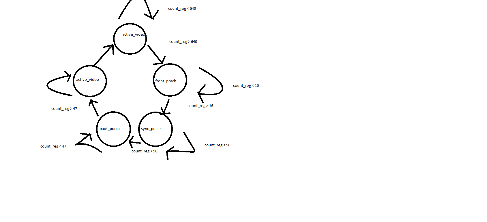
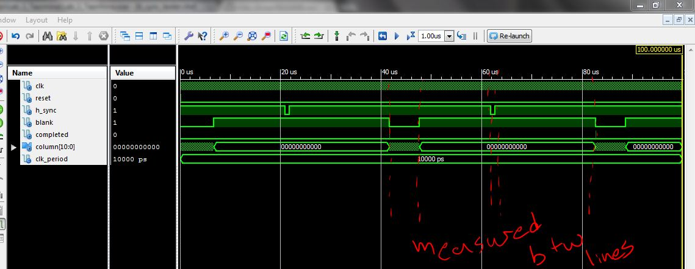

VGA_Driver
==========

Introduction
============
The object of this lab was to write VHDL code to synchronize an FPGA with a VGA display.

Implementation
==============



```vhdl
State machine h_sync

state_next <= state_reg;
	
			case state_reg is
				when active_video=>
					if(count_reg = 640) then 
						state_next <= front_porch;				
					end if;	
				when front_porch=>
					if(count_reg = 14) then
						state_next <= sync_pulse;						
					end if;	
				when sync_pulse=>
					if(count_reg = 96) then
						state_next <= back_porch;					
					end if;	
				when back_porch=>
					if(count_reg = 45) then
						state_next <= completed_state;					
					end if;	
				when completed_state=>						
						state_next <= active_video;
					
			end case;
```
`VGA_Driver.vhd`
-This is the main top level implementation where vga_sync, dvid, and pixel_gen are instantiated. They are all interconnected with signals created here. The component looks like this:

```vhdl
entity atlys_lab_video is
    port ( 
             clk   : in  std_logic; -- 100 MHz
             reset : in  std_logic;
		     SW0   : in std_logic;
			 SW1   : in std_logic;
             tmds  : out std_logic_vector(3 downto 0);
             tmdsb : out std_logic_vector(3 downto 0)
         );
			
		
end atlys_lab_video;
```

`vga_sync.vhd`
-This is where v_sync and h_sync are connected to each other. Their main connection is the completed signal. The only output is when either vertical or horizontal are blank.

```vhdl
entity vga_sync is
    port ( clk         : in  std_logic;
           reset       : in  std_logic;
           h_sync      : out std_logic;
           v_sync      : out std_logic;
           v_completed : out std_logic;
           blank       : out std_logic;
           row         : out unsigned(10 downto 0);
           column      : out unsigned(10 downto 0)
     );
end vga_sync;
```

`h_sync_gen.vhd`
-This generates the horizontal row of synchronization signals. It switches between 5 states: active_video, front_porch, sync_pulse, back_porch, completed. It sets blank low when in active video, h_sync low when in the sync_pulse, and completed high when in completed_state. It contains three flip-flops that govern next state logic, next count logic, and count reseting.

```vhdl
entity h_sync_gen is
    port ( clk       : in  std_logic;
           reset     : in  std_logic;
           h_sync    : out std_logic;
           blank     : out std_logic;
           completed : out std_logic;
           column    : out unsigned(10 downto 0)
     );
end h_sync_gen;
```

`v_sync_gen.vhd`
-This generates the vertical row of synchronization signals. It switches between 5 states: active_video, front_porch, sync_pulse, back_porch, completed. It sets blank low when in active video, h_sync low when in the sync_pulse, and completed high when in completed_state. It contains three flip-flops that govern next state logic, next count logic, and count reseting. It is very similar to h_sync but only operates while h_completed it high. h_sync and v_sync alternate.

```vhdl
entity v_sync_gen is
    port ( clk         : in  std_logic;
           reset       : in std_logic;
			  h_blank     : in std_logic;
           h_completed : in std_logic;
           v_sync      : out std_logic;
           blank       : out std_logic;
           completed   : out std_logic;
           row         : out unsigned(10 downto 0)
     );
end v_sync_gen;
```

`pixel_gen.vhd`
-This signal sets values to r, g and b to display certain colors on the display. The higher the number the brighter the color. There are four sets of different r,g,b values that correspond to different switch values for A functionality.

```vhdl
entity pixel_gen is
    port ( row      : in unsigned(10 downto 0);
           column   : in unsigned(10 downto 0);
           blank    : in std_logic;
			  switch0  : in std_logic;
			  switch1  : in std_logic;
           r        : out std_logic_vector(7 downto 0);
           g        : out std_logic_vector(7 downto 0);
           b        : out std_logic_vector(7 downto 0));
end pixel_gen;
```

Test/Debug
==========
- After the plug in and pray method of testing my code didn't produce results I decided to write test benches 
for h_sync_gen and v_sync_gen. They were simple test benches that allowed continuous iteration of the active_video, 
front_porch,sync_pulse, back_porch, and completed states. This allowed me to check the length of each of the states 
and adjust their values in the code to make them perfect.

- I ran into a problem with sensitivity lists. All of my code seemed to be correct and I wasn't leaving anything 
out but the screen would just flicker black. I figured it was something with h_sync and v_sync so I went through and cleaned 
them up. By cleaned them up I mean that I separated my convoluted state machine logic into two separate processes and made sure 
I had all correct flip-flops. I then added a lot of signals to the sensitivity lists of each process until
there was a pattern displayed on the screen.

- Another problem I ran into was in trying to get the A functionality. I thought that the code was perfect but the
switched did not change anything. After some advice I added code to the user constraint file and that fixed the problem 
immediately.

- I ran into many small syntactical problems that I really solved with brute force. I looked up things in the book
or on the internet or just read the console and tried things.

-Here's an example of testing my `h_sync_gen.vhd`



Conclusion
==========
From this lab I definitely took away how precise VGA synchronization has to be. It made me appreciate
the power and capability of the FPGA. It also showed me that with time and practice even I can learn VHDL 
it just takes time and patience. Next time I would probably finish the code for h_sync_gen and v_sync_gen as
part of the pre lab because those were the crux of this lab and the major time consumers.


Documentation
=============
C2C Michael Bentley, C2C John Miller, C2C Colin Busho, and C2C Ryan Good gave me advice 
on ways they solved the problems they encountered, mainly what to do with certain signals
when there are errors. John showed me that I had a problem with my board settings such that
the program would not map. Michael and John gave me advice on expanding my congested state machines.Ryan 
told me that I needed to write code in the constraints file to use the input switches.
All of this advice lead to my completion of the lab.
